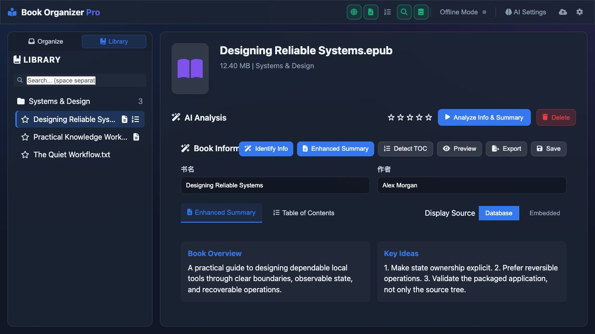
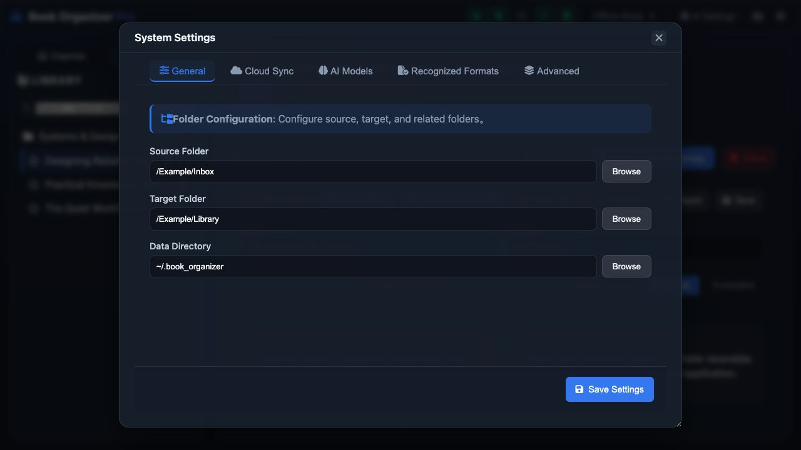

# Book Organizer

[](https://github.com/roanpy/book-organizer/actions/workflows/ci.yml)
[](LICENSE)

Local-first ebook organization, metadata analysis, preview, and library maintenance.

[简体中文](README.zh-CN.md) · [Security](SECURITY.md) · [Contributing](CONTRIBUTING.md)



## Highlights

- Organize books with local rules or optional Gemini, DeepSeek, Ollama, and LiteLLM-compatible providers.
- Extract metadata, covers, summaries, and tables of contents without changing source files by default.
- Preview PDF, EPUB, TXT, and Markdown locally. Unsupported ebook formats can use an existing same-name PDF or optional Calibre conversion.
- Maintain a searchable local library with duplicate detection, ratings, path repair, and configurable recognized formats.
- Synchronize the database and portable preferences through a user-selected folder. API keys stay local by default.
- Run as a local web app or a packaged desktop application. The server listens on `127.0.0.1` by default.

## Screenshots

| Library | Settings |
| --- | --- |
|  |  |

Chinese UI screenshots are available in [README.zh-CN.md](README.zh-CN.md).

The UI follows the operating-system language. Add `?locale=en` or `?locale=zh-CN` to the local URL to preview a specific language.

## Supported Formats

Direct preview and richer metadata support focus on EPUB and PDF. TXT, MD, and Markdown are supported as lightweight read-only formats. MOBI, AZW, AZW3, FB2, and other formats may be managed when enabled in Settings; preview falls back to a same-name PDF or optional Calibre conversion.

Recognized extensions are configurable in **Settings → Recognized Formats**. Files not selected there are ignored by scanning and library path repair.

## Quick Start

Requirements: Python 3.11, 3.12, or 3.13.

```bash
git clone https://github.com/roanpy/book-organizer.git
cd book-organizer
python3 -m venv venv
source venv/bin/activate
python -m pip install -r requirements.txt
./scripts/start_web.sh
```

Open `http://127.0.0.1:18000`.

AI is optional. Configure providers from the local Settings screen; never commit local configuration files or credentials.

## Local Data and Privacy

Book Organizer stores its working data under `~/.book_organizer/` by default:

- `book_organizer_config.json`: paths, preferences, and local provider configuration
- `book_data.db`: the local library database

Portable preferences can be synchronized, but API keys and tokens are excluded unless the user explicitly enables sensitive credential sync. Preview responses use `no-store`; previews do not create reading-progress records or modify the source book.

## Desktop Builds

```bash
./scripts/build_standalone.sh
```

The packaged desktop application is verified on Apple Silicon macOS. The source also runs as a local web app on Python-supported systems; no Windows desktop bundle is currently published. The macOS build script runs bundle privacy checks before producing `dist/BookOrganizer.app`. See [RELEASING.md](RELEASING.md) for the release workflow.

## Development

```bash
python -m pip install -r requirements-dev.txt
PYTHONPATH=src python -m pytest
PYTHONPATH=src ruff check src tests
node --check static/app.js
python scripts/check_public_safety.py
```

Runtime dependencies are pinned in `requirements.txt`; build and development additions live in `requirements-build.txt` and `requirements-dev.txt`.

## Optional Tools

- [Calibre](https://calibre-ebook.com/) provides `ebook-convert` for optional PDF conversion. It is not bundled. Exported PDFs can then be imported manually into services such as NotebookLM.

The main branch does not bundle a cloud-drive SDK or perform automatic uploads. The former Google Drive integration is preserved on the `archive/google-drive-integration` branch.

## License

[MIT](LICENSE)
