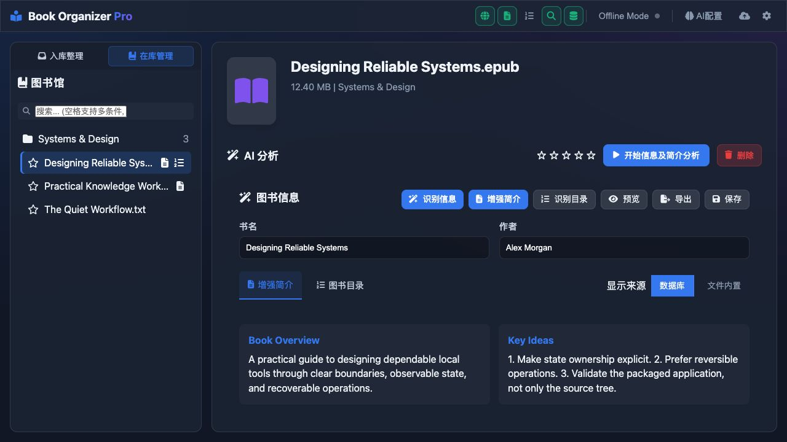
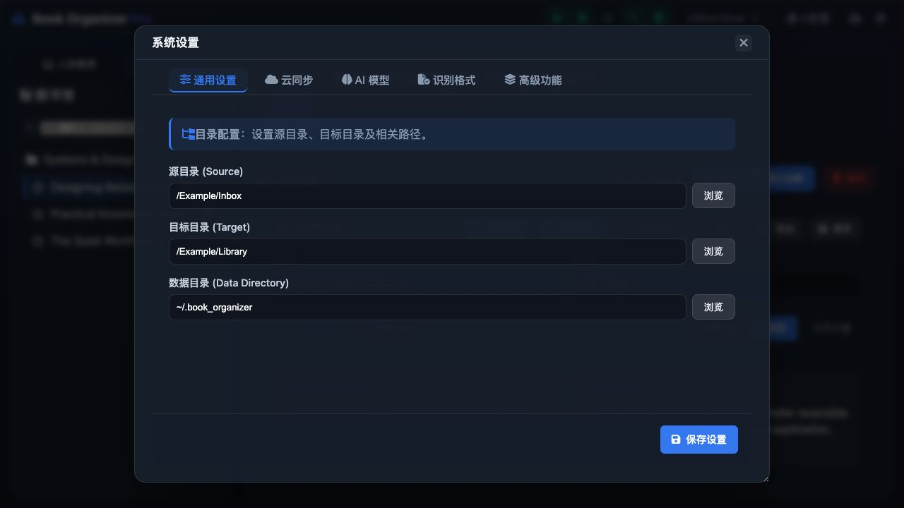

# Book Organizer

本地优先的电子书整理、元数据分析、预览和书库维护工具。

[English](README.md) · [安全说明](SECURITY.md) · [参与贡献](CONTRIBUTING.md)



## 主要功能

- 使用本地规则，或可选的 Gemini、DeepSeek、Ollama 与 LiteLLM 兼容服务整理图书。
- 提取元数据、封面、增强简介和目录；默认不改写原始文件。
- 本地预览 PDF、EPUB、TXT 和 Markdown；其他电子书格式可优先打开同名 PDF，或按需调用 Calibre 转换。
- 提供本地书库搜索、查重、评分、路径自动适配和可配置识别格式。
- 通过用户指定目录同步数据库和跨平台偏好；API Key 默认仅保存在本机。
- 可作为本地 Web 应用或桌面程序运行，默认仅监听 `127.0.0.1`。

## 界面截图

| 在库管理 | 系统设置 |
| --- | --- |
|  |  |

界面默认跟随系统语言。本地地址添加 `?locale=en` 或 `?locale=zh-CN` 可以指定语言。

## 快速开始

需要 Python 3.11、3.12 或 3.13。

```bash
git clone https://github.com/roanpy/book-organizer.git
cd book-organizer
python3 -m venv venv
source venv/bin/activate
python -m pip install -r requirements.txt
./scripts/start_web.sh
```

浏览器打开 `http://127.0.0.1:18000`。AI 服务不是运行必需项，可在本地设置界面按需配置。

## 本地数据与隐私

默认数据目录是 `~/.book_organizer/`，其中包括配置和数据库。跨平台偏好可以同步，但 API Key 和 Token 默认不参与同步。预览不会记录阅读进度，不修改图书源文件。

识别格式可在 **系统设置 → 识别格式** 中配置；未选中的格式不会参与扫描、在库管理和路径修复。

## 构建与开发

```bash
python -m pip install -r requirements-dev.txt
PYTHONPATH=src python -m pytest
PYTHONPATH=src ruff check src tests
python scripts/check_public_safety.py
./scripts/build_standalone.sh
```

Calibre 的 `ebook-convert` 只用于可选的 PDF 转换，不随程序捆绑。生成的 PDF 可手动导入 NotebookLM 等服务；主分支不包含云盘 SDK，也不会自动上传。原 Google Drive 集成保存在 `archive/google-drive-integration` 分支。

## 许可证

[MIT](LICENSE)
